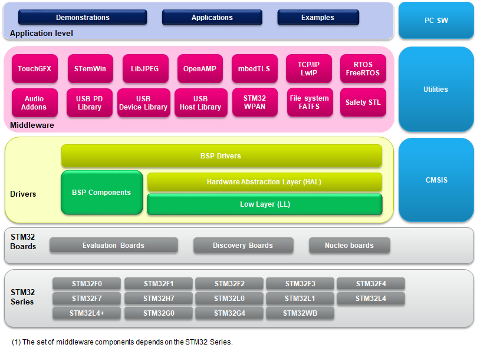

::: {.row}
::: {.col-sm-12 .col-lg-4}

# <small>Release Notes for</small> <mark>X-CUBE-CLASSB-G4</mark>
# <small>Expansion package of STM32Cube for STM32G4 MCUs</small>
Copyright &copy; 2023 STMicroelectronics\

{.logo}

# Purpose

The X-CUBE-CLASSB-G4 self-test library (STL) is an application-independent software test library released by ST to implement a relevant subset of safety mechanisms applicable to generic parts of the STM32G4 Series microcontrollers required by the safety standard targeting inhouse appliances.

STL is an autonomous software, which executes on application demand selected tests to detect HW issues and reports the outcomes to the application. STL is delivered partly in object code (for the library itself) and partly in source code for the user interfaces definition and user parameters settings. Therefore, the STL is compilation tool chain-agnostic, so it can be compiled by any standard C-compiler.

The X-CUBE-CLASSB-G4 is built on top of STM32Cube software technology and follow principles derived from another ST safety library dedicated for industrial appliances (X-CUBE-STL).

X-CUBE-CLASSB-G4 software features:

- STL tests of the CPU Arm® core.
- STL tests of the Flash memory.
- STL tests of the RAM.

The X-CUBE-CLASSB-G4 software comes with implementation example running on NUCLEO-G474RE. This implementation example provides:

- Template of a user defined module dedicated for testing the CPU clock system.
- Set of predefined compilation flags supports testing of APIs artificial failing control.
- Set of predefined failing codes supporting identification of APIs failures at Fail safe mode entry.

The figure below shows the overall architecture.

Here is the list of references to user documents:

-   UM2454 STM32G4 series safety manual
-   UM3167 STM32G4 Series UL/CSA/IEC 60730-1/60335-1 Class B self-test library user guide

:::

::: {.col-sm-12 .col-lg-8}
# Update History
::: {.collapse}
<input type="checkbox" id="collapse-section3" checked aria-hidden="true">
<label for="collapse-section3" aria-hidden="true">__V4.0.0 / 29-June-2023__</label>

## Main Changes

### First release of the library based on precompiled object code format

## Contents

**Projects**

The X-CUBE-CLASSB-G4 package:

  - comes with an STL integration aplication example running on STMicroelectronics board, NUCLEO-STM32G474RE
  - the application example is ported on 3 toolchains

  Name          Version       Release note
  ---------     --------      --------------------------------------------------------------------------------
  Projects      V4.0.0        [release note](Projects\Release_Notes.html)

## Components
<small>The components flagged by "[]{.icon-st-update}" have changed since the
previous release. "[]{.icon-st-add}" are new.</small>

**Drivers**

  Name                                Version        Release note
  ----------------------------------  -------------  ------------------------------------------------------------------------------------------------------------------------------------------------
  Cortex®-M CMSIS                     V5.6.0_cm4     [release note](Drivers/CMSIS/Docs/index.html)
  STM32G4xx CMSIS                     V1.2.2         [release note](Drivers/CMSIS/Device/ST/STM32G4xx/Release_Notes.html)
  BSP STM32G4xx_Nucleo                V1.0.4         [release note](Drivers/BSP/STM32G4xx_Nucleo/Release_Notes.html)
  STM32G4 HAL/LL APIs                 V1.2.2         [release note](Drivers/STM32G4xx_HAL_Driver/Release_Notes.html)

**Middlewares**

  Name                                Version        Release note
  ----------------------------------  -------------  ------------------------------------------------------------------------------------------------------------------------------------------------
  Safety Self Test Library (STL)      V4.0.0         [release note](Middlewares/ST/STM32_Safety_STL/Release_Notes.html)

## Documents
<small>The components flagged by "[]{.icon-st-update}" have changed since the
previous release. "[]{.icon-st-add}" are new.</small>

  Name                                                                                Document
  ------------------------------                                                      -----------------------------------------------------------------------------------------------------------------------
  STM32G4 Series UL/CSA/IEC 60730-1/60335-1 Class B self-test library user guide      UM3167, visit: [www.st.com/embedded-software/x-cube-classb](http://www.st.com/en/embedded-software/x-cube-classb.html) to get the most updated version

## Development Toolchains and Compilers

- IAR Embedded Workbench for ARM (EWARM) toolchain V9.30.1 + ST-Link
- RealView Microcontroller Development Kit (MDK-ARM) toolchain V5.36 + ST-Link
- STM32CubeIDE V1.9.0

## Supported Devices and boards
-   STM32G474RE Nucleo kit (MB1367 Rev C)

## Known Limitations

- None

## Backward Compatibility

- Not applicable

:::

:::
:::

<footer class="sticky">
For complete documentation on STM32G4xx, visit: [www.st.com/stm32g4](http://www.st.com/stm32g4);
[www.st.com/STM32](https://www.st.com/en/microcontrollers-microprocessors.html)

This release note uses up to date web standards and, for this reason, should not be opened with Internet Explorer
but preferably with popular browsers such as Google Chrome, Mozilla Firefox, Opera or Microsoft Edge.
</footer>

